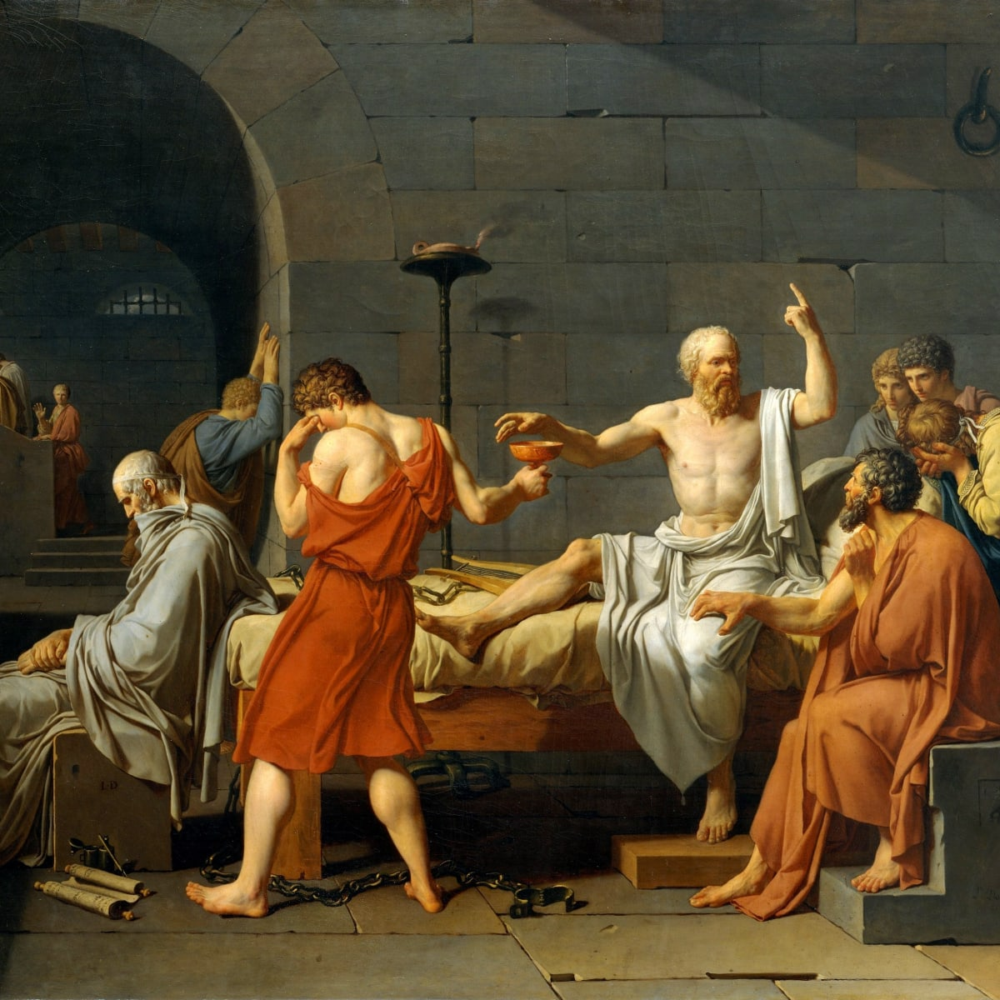
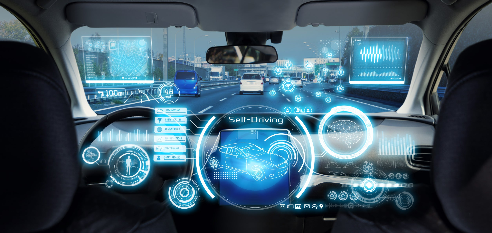

  

## The Meaning of Life?
What does it mean to be ethical? That is a question that I hope that everyone has considered at some point in their lives. I feel that the study of ethics is somewhat underrepresented in education. I personally did not really know anything about it until I was an adult and took several classes on the subject during my university career. Now that I think about it, maybe this is for the better. Imagine trying to teach high schoolers that their actions have consequences. I myself do not think that I would have had enough life experience as an adolescent to fully comprehend and internalize some concepts and would have likely found the subject boring, but I digress. Ethics is an interesting and vitally important topic, because it broadly tackles the age-old question of the "meaning of life." When specifically applied to professions, ethics are like a signpost, pointing out the "right" direction to go with our actions. I like to think of it broadly as asking myself "how can I make the lives of as many people as I can better?" or conversely, "how can I not ruin the lives of as many people as possible?" Very difficult, nay impossible questions to answer, but that does not mean that we should not try.

  

## Self Driving Cars: An Ethical Puzzle
I personally find the ethical conundrum regarding self-driving cars to be extremely fascinating. There have been many times where I have discussed the issue with other people at length as a way to pass the time. I myself am a huge proponent of self-driving cars. I think that self-driving cars done right would be vastly safer than your average human drover, and would be way more efficient in terms of time and space. I actually have a running gag with people I frequently ride in cars with. Whenever I am in a car and I see some road rage incident or careless and dangerous driving, I will turn to whoever is in the car with me and say "This is why we need self-driving cars." Now, they  anticipate it and often say it at the same time with a sort of "yeah yeah I get it" sort of attitude. Anyway, the ethical problem of self-driving cars somewhat boils down to weighing lives and choosing who dies, a.k.a. the trolley problem. When, not if, something goes wrong and a self-driving car is in a situation where every choice leads to a fatality, how does it choose? I do not envy those who have to make this decision, because it is an ethical can of worms. 

Some have tried to solve this question by polling a large amount of people on what they would do in different situations and base the algorithm on that, but that has its own set of problems. How do you ensure that you have surveyed enough people in all demographics to form a clear majority? How do you prevent abuse of minority, and prevent ethnocentric mindsets from skewing data? You also have to define a responsible party. Insurance companies and car manufacturers clearly have vested interests on who is held responsible for an accident. Is it the programmer? The car company? The owner of the car? Regarding the choice of who to save, how do you make that choice? Do you prioritize the young or the elderly? The most amount of people? Do you take things like health conditions, profession, criminal record into account? There are too many variables to consider. 

Personally, I feel that I do not have the knowledge or expertise to really make any useful statement on the ethical stance to take. If I had to state an opinion right now, I think a software engineer working on this should be doing everything in their power to write code that will minimize the probably of the situation occurring in the first place. When it comes to the trolley situation itself, the programmer should listen to the team of ethicists that were likely hired for this exact purpose and write code based on their decision. All joking aside, it is the responsibility of the software engineer to constantly question the specifications of the code that they are asked to write. Does it put anyone in unnecessary harm? Does it have an unfair bias/preference for people it will/will not choose? Is the good of the people, and not some private agenda, upheld and pursued? They have an ethical obligation to rigorously and viciously stamp out bugs in their code, and ensure that decisions that are fair and just are made based on what they believe is ethical.