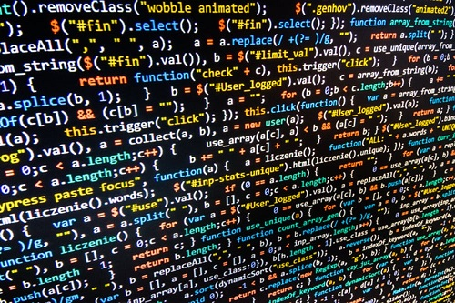

  

My experience with coding standards have pretty much been purely aesthetic, how many lines to indent, where to put curly braces, how many spaces to put before lines, etc. Coding standards are great and something that I think every programmer should internalize. They provide a significant amount of benefits, like readability-at-a-glance, for virtually no downside.

The problem is when implementing a coding standard disrupts the work flow. Personally, I think that using ESLint with IntelliJ is a bit cumbersome. The fact that you seem to have to have some files in order for ESLint to function is a bit irritating, as you basically have to spend some time setting it up for every new project. I would much prefer being able to just quickly start a project and write code and trust that my IDE is properly flagging errors without having to do administrative work. I recognize, however, that I do not know enough about IntelliJ or ESLint to definitively say if it is possible to configure the IDE in such a way that circumvents the setup.

ESLint itself, howover, is great in that it improves certain aspects of code and establishes good habits. An example of this would be how it tells you when it would be better to use "const" or "let" when declaring a variable. It also flags when variables are not used or when function calls serve no purpose. This is great for making code better and more concise. Another nice thing about ESLint with Intellij is the fact that you can just click on errors and violations in coding style to fix them and make the code compliant with the standards. This is a very nice feature for me personally, because I tend to just write code without being particularly mindful of code style or readability. Once I am finished writing code, I can just apply code style fixes through the editor to format the code to be more readable.

