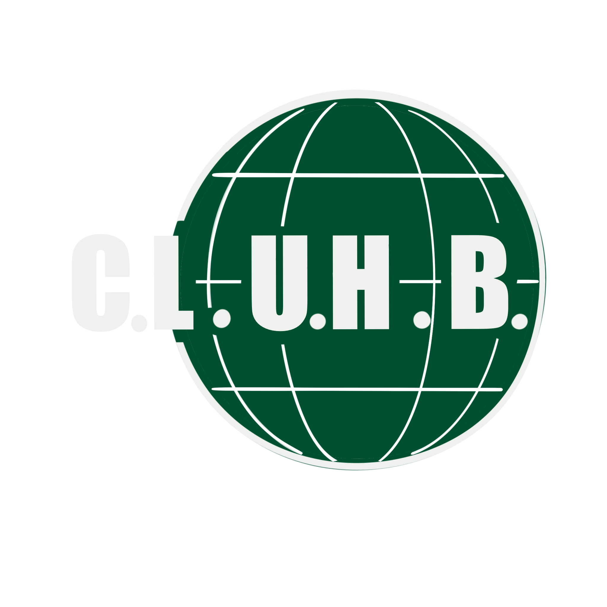
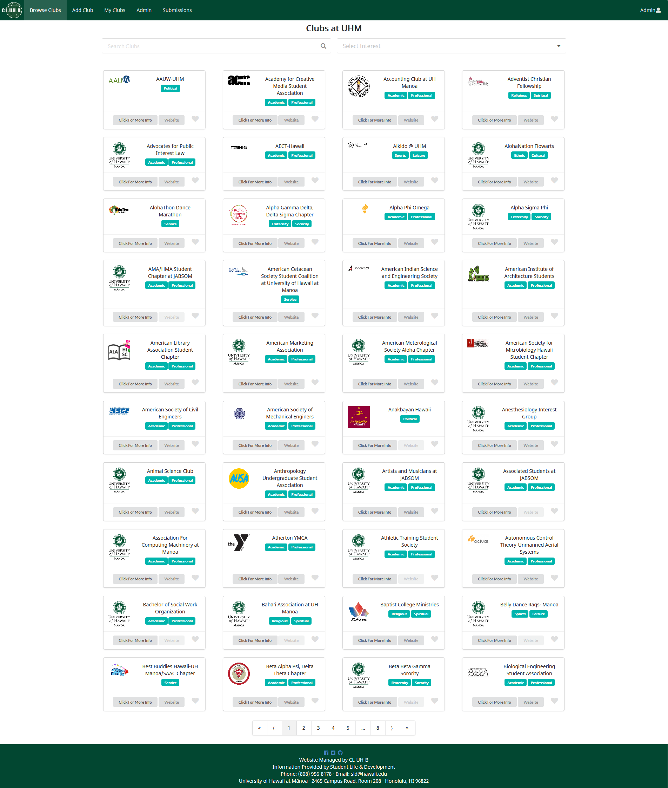

  

For a final project in a software engineering course, three of my peers and I were assigned to create a web applications that listed all of the clubs at UH. The website makes use of Meteor for client and server code, and React and Semantic UI for user interface. The website lists all of the clubs at UH and allows users to filter by interest. Club managers are able to edit clubs and submit new ones. More information can be found here: https://cl-uh-b.github.io/

  

I specifically worked on getting all of the club data into the application's database and making it available across all of the different pages. I also worked on the ListClub page and filter feature. 
