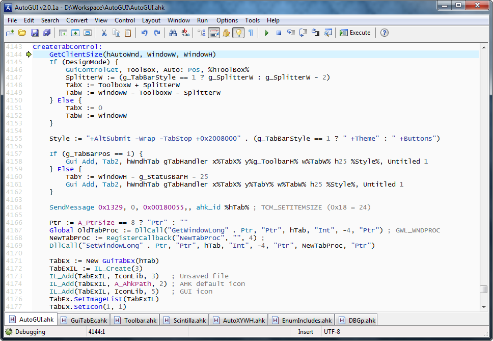

  

image taken from the AutoHotKey forums: https://www.autohotkey.com/boards/viewtopic.php?t=10157

I use assistive technology that simulates mouse movement and left/righf clicking to operate a computer because I do not have the use of my hands. Luckily, thanks to the many Accessibility programs and features that are included in pretty much every modern operating system, like the Windows On-Screen keyboard, a mouse is all you really need to be able to do everything on a computer. This does not, however, mean that it is convenient. A lot of programs, particularly video games, have hotkeys that require things like holding down certain combination of keyboard presses. Ctrl+s is an example of one such hotkey. 

After being somewhat annoyed with extremely repetitive tasks that required a lot of keyboard inputs, I decided to try to learn AutoHotKey, which is a scripting language geared towards keyboard and mouse macros. Luckily, the language is pretty easy to learn and there are a ton of learning resources for it available online. I learned quite a bit from the experience. It taught me how to be resourceful when being faced with a problem, and to take advantage of software in order to make things convenient, which is something I think programmers always strive to do. It also taught me the usefulness, and dangers, of scripts in general. Scripts can be a very powerful tool, but one has to always be careful when it comes to manipulating files or input/output, as a careless script can cause serious damage to a system. After some close calls and scary moments, I try to be as diligent as I can now before running a script.
