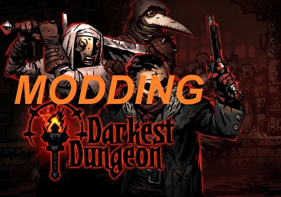

  

image modified from the Steam page: https://store.steampowered.com/app/262060/Darkest_Dungeon/

During one summer break, I decided to finally try a somewhat well-known indie game called "Darkest Dungeon." The description states that "Darkest Dungeon is a challenging gothic roguelike turn-based RPG about the psychological stresses of adventuring." I think that quite a few people, including myself, see the description "challenging" as inadequate. The game is extremely punishing and unforgiving. There is very little room for error and the player is always in a disadvantageous position . I would guess that the majority of the people who played the game never finished it due to its difficulty. After I spent more time than I would like to admit, I finally beat the game. I enjoyed the game so much that I wanted to keep playing it. The only problem with this, however, was that I already experienced everything that the game had to offer. This is where modding came in.

One of the great things about Steam, the distribution platform for the game, is that it has a section for people to publish mods that they have created for a game to share with other users. After downloading and playing around with mods that added more content and changed the balance of the game, I wanted to try modding the game myself. Luckily, the game developers made the game extremely easy to mod, so a complete novice like me was able to easily learn how to mod it. It was an eye-opening experience. For starters, it was my first time modifying preexisting code of a video game. It also provided me with an in-depth look into how a lot of the systems in the game worked and interacted with one another, which gave me a better idea of how one might want to approach implementing various systems that affected one another. I also learned just how much testing you have to do, and the importance of getting certain numbers right. Modifying things like attack values even the slightest amounts can have cascading effects that heavily impact the balance of the game. It was also neat to be able put my own spin on the game by adding and changing things. The experience gave me the opportunity to stretch my creative muscles to push the limits of an existing system and to try different things, as well as gain a better understanding of games and intricate software that incorporates visual and audio assets.
